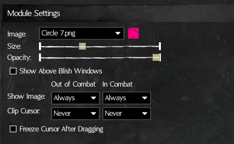

# MouseCuror
The MouseCuror module is a [Blish HUD](https://blishhud.com/) module which allows to display a custom image around the position of the mouse cursor to more easily keep track of it during hectic situations.

# Download the Pathing Module
You can downlaod the Pathing module from:

- Our [Releases](https://github.com/manlaan/BlishHud-MouseCursor/releases) page here on GitHub.
- The Blish HUD repository while in-game.
  
In any case, you can review the Blish HUD [module install guide](https://blishhud.com/docs/user/installing-modules) for more details.

# Settings
The now offers a split behavior between in and out of combat with 4 options to choose from and now also offers a mouse clipping feature. By default nothing is shown and nothing is clipped.
 In addition, to combat random pointer jumps, an option to freeze the cursor for a customizable time after dragging, was added.

